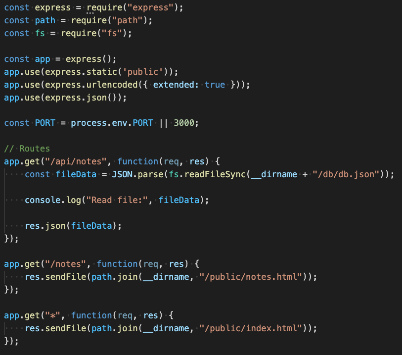
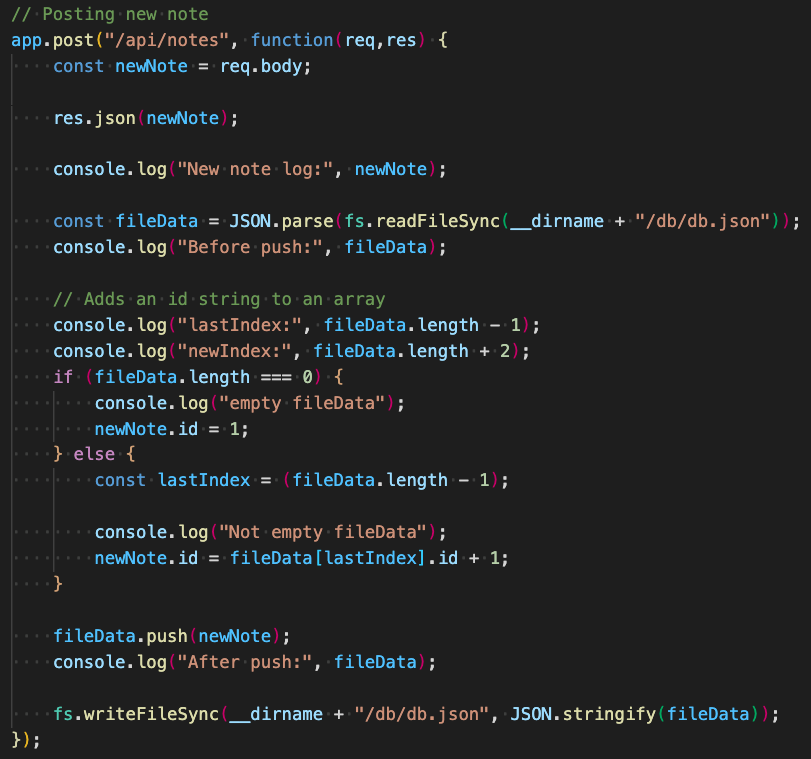
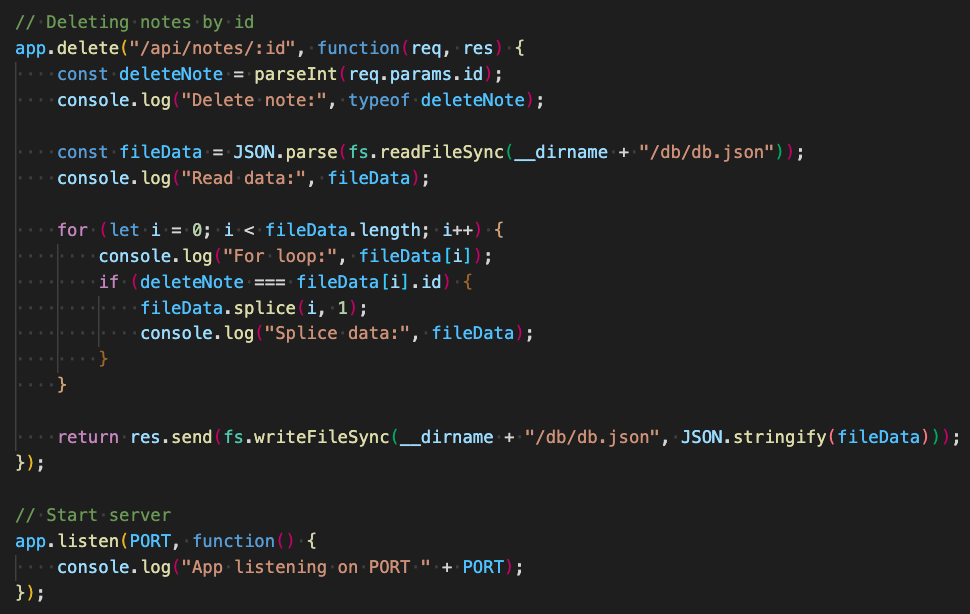

# Note-Taker

## Description
Application that can be used to write, save, and delete notes. This application will use an express backend and save and retrieve note data from a JSON file.

## Links
* [Github Repository](https://github.com/jkaganovsky/Note-Taker)
* [Heroku](https://notes-logging.herokuapp.com/)

## Installation & Usage
<u>FEATURES</u>
1. Allows the user to save a new note.
1. Allows the user to refresh the page and see their previously saved notes.
1. Allows the user to delete a selected note.
1. Allows the user to click on a note to view its contents.

<u>GITHUB</u>
1. Clone this repository from my [Github Repository](https://github.com/jkaganovsky/Note-Taker) link.
1. Run your local computer's terminal and git clone this repository to save to your local computer.
1. Install Node.js to your local computer if you don't have it (https://nodejs.org/en/).
1. Run `npm i inquirer` from your computer's terminal to install the **Inquirer** package to the cloned repository's folder.
1. Run `node server.js` or `npm run watch` on your terminal.
1. Open your browser with the filepath localhost:3000 to start the application.

<u>HEROKU</u>
* Open the [Heroku](https://notes-logging.herokuapp.com/) link and start using the application

## Content
<u>DEMO</u>

    

<u>SCREENSHOTS</u>

    - server.js

    

    

    

## Credits
1. My Trilogy Education Tutor, Jacob Carver - https://www.linkedin.com/in/jacob-carver-software-developer125b81191/
1. How to use delete functions in Express - https://www.codota.com/code/javascript/functions/express/Express/delete
1. JavaScript string and number conversion - https://stackoverflow.com/questions/971039/javascript-string-and-number-conversion

## License
MIT License

Copyright (c) [2020] [Jailanie Kaganovsky]

Permission is hereby granted, free of charge, to any person obtaining a copy
of this software and associated documentation files (the "Software"), to deal
in the Software without restriction, including without limitation the rights
to use, copy, modify, merge, publish, distribute, sublicense, and/or sell
copies of the Software, and to permit persons to whom the Software is
furnished to do so, subject to the following conditions:

The above copyright notice and this permission notice shall be included in all
copies or substantial portions of the Software.

THE SOFTWARE IS PROVIDED "AS IS", WITHOUT WARRANTY OF ANY KIND, EXPRESS OR
IMPLIED, INCLUDING BUT NOT LIMITED TO THE WARRANTIES OF MERCHANTABILITY,
FITNESS FOR A PARTICULAR PURPOSE AND NONINFRINGEMENT. IN NO EVENT SHALL THE
AUTHORS OR COPYRIGHT HOLDERS BE LIABLE FOR ANY CLAIM, DAMAGES OR OTHER
LIABILITY, WHETHER IN AN ACTION OF CONTRACT, TORT OR OTHERWISE, ARISING FROM,
OUT OF OR IN CONNECTION WITH THE SOFTWARE OR THE USE OR OTHER DEALINGS IN THE
SOFTWARE.
